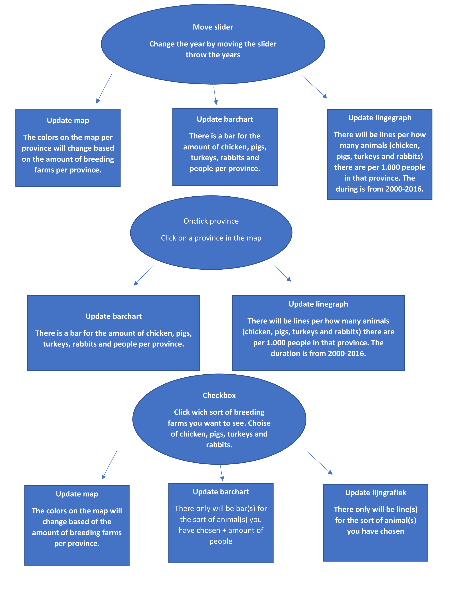

Design document animal change
===============================

#### In this document you could read the technical parts for the programming project about the animal change in The Netherlands between 2000-2016. Including the technical user disicion diagram, data source AND ??

Name: Bob Borsboom

Studentnumber: 10802975

Course: Programming project

Technical user disicion diagram:
-----------------------

#### components description:
##### Slider: For the slider I need data from multiple years. Next to that I need three update functions. 1 for the map, 1 for the barchart and 1 for the linegraph.
##### Onclick map: For the onclick map I need data per province. Next to that I need two update functions. 1 for the barchart and 1 for the linegraph
##### Onclick checkbox: For the Onclick checkbox I need data of the amount of breeding farms per animal per province. Next to that I need three update functions. 1 for the map, 1 for the barchart and 1 for the linegraph.

#### Data:
For the line graph the data should be transformed. The amount of animals per 1.000 people will be showed. 
Therefor the amount of animals must be divided by the population amount

Data from CBS about the amount of breeding farms per province and the amount of animals per province
http://statline.cbs.nl/Statweb/publication/?DM=SLNL&PA=80780ned&D1=542,560,572-575,578-579&D2=0,5-16&D3=a&HDR=G1,G2&STB=T&VW=T

Data from CBS about the amount of people in The Netherlands:
http://statline.cbs.nl/Statweb/publication/?DM=SLNL&PA=37556&D1=0&D2=101-118&HDR=G1&STB=T&VW=T
