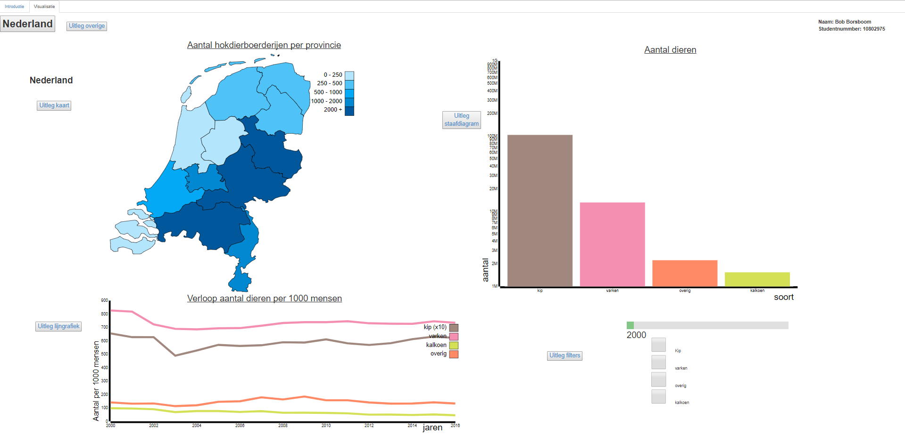

Link to visualisation: https://boeboska.github.io/Programmeerproject/hokdierenNL/index.html

Note: please set screen the zoom to 50% for a good view off the visualisation

Project Animal Change 2000 - 2016
===============================

#### In this document you could read the project proposal, how to use the visualisation, the goal of the visualisation, sources, and the license.

Name: Bob Borsboom

Studentnumber: 10802975

Course: Programming project

#### How to use the visualisation:
Click on the link to the visualisation above. You will be redirected to the webpage of the visualisation. On the webpage you can find the explanation on how to use the visualisation. Read "goals of the visualisation" (below here) to read about the different graphs wich are used in the visualisation.

Problem statement:
-----------------------
In the Netherlands there is a discussion about the amount of meat we eat. Some experts say that we eat to much meat. Eating to much meat is bad for climate, health and the animals we eat do not have a fun life.
For example: If you should not eat meat for 3 days on weekly basis, that would be equal to deleting 3.000.000 cars in The Netherlands.

Goal of the visualisation:
-----------------------
The goal of the visualisation is that the consumers become aware of the current amount of meat they use. In the visualisation there are three main graphs. A map where the user can see the distribution of the breeding farms in the Netherlands, a barchart where they can see the exaxct amount of animals (chicken, pigs, turkeys and other) and a linegraph where they can see the change over time. Next to the three main graphs the user can slide between years, click on different provinces and filter on animals. There are therefore sufficient possibilities to give the user enough information.

Project propocal
------------------

#### Sketch: 

This is the sketch made before the start of the project.

#### minimum viable product:
- on hover province: highlight + exact amount of breeding farms;
- on click province: update barchart + update linegraph;
- slider (years): update map numbers + colors;
- check box: select type of breeding farm (chicken, pig, turkey or rabbit);
- show/hide line.

#### Data transformation:
For the line graph the data is transformed. The amount of animals per 1.000 people will be showed. Therefor the amount of animals is divided by the amount of people.

#### Sources of external code:
Note: I do not own the copyrights of these sources.

The external include sources needed for the project are:
- D3 v3: d3js.org/d3.v3.min.js
- D3 tooltip: http://labratrevenge.com/d3-tip/javascripts/d3.tip.v0.6.3.js
- D3 queue: http://d3js.org/queue.v1.min.js
- D3 topoJson: http://d3js.org/topojson.v1.min.js
- Bootstrap: https://maxcdn.bootstrapcdn.com/bootstrap/3.3.7/css/bootstrap.min.css
- Jquery: https://ajax.googleapis.com/ajax/libs/jquery/3.2.1/jquery.min.js

External code sources:
- barchart: https://bl.ocks.org/RandomEtc/cff3610e7dd47bef2d01
- lijngrafiek: https://bl.ocks.org/mbostock/3884955
- map: http://bl.ocks.org/phil-pedruco/9344373

#### External data-sources:
Note: I do not own the copyrights of these sources.

Data from CBS about the amount of breeding farms per province and the amount of animals per province
http://statline.cbs.nl/Statweb/publication/?DM=SLNL&PA=80780ned&D1=542,560,572-575,578-579&D2=0,5-16&D3=a&HDR=G1,G2&STB=T&VW=T

Data from CBS about the amount of people in The Netherlands:
http://statline.cbs.nl/Statweb/publication/?DM=SLNL&PA=37556&D1=0&D2=101-118&HDR=G1&STB=T&VW=T

#### Similar visualisation: 
http://www.kipinnederland.nl/feiten-en-cijfers

In this visualisation you see the amount of chicken breeding farms in The Netherlands between 2010 - 2014. Next to that you see the average amount of chickens per chicken breeding farm.
In my visualisation about the same data will be presented

#### Copyright:

for the copyright, see license.md
