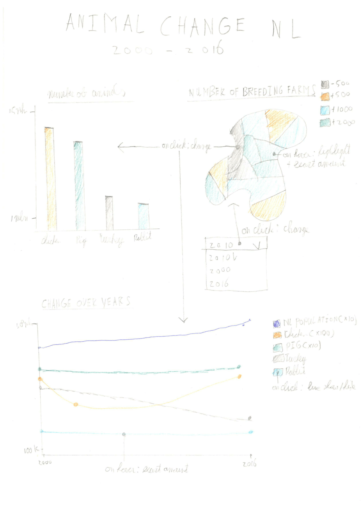
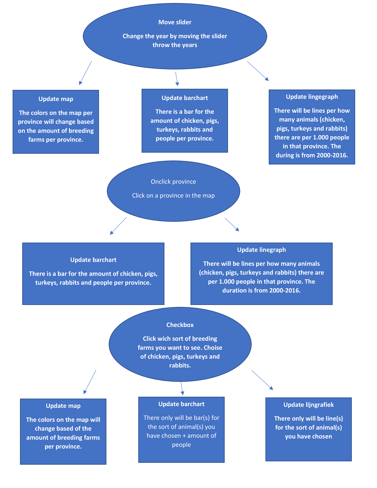

Link to visualisation: https://boeboska.github.io/Programmeerproject/animalchange/index.html

Project Proposal animal change
===============================

#### In this document you could read the proposal for the programming project about the animal change in The Netherlands between 2000-2016
Name: Bob Borsboom

Studentnumber: 10802975

Course: Programming project

Problem statement:
-----------------------
In the Netherlands there is a discussion about the amount of meat we eat. Some experts say that we eat to much meat. Eating to much meat is bad for climate, health and the animals we eat do not have a fun life.
For example: If you should not eat meat for 3 days on weekly basis, that would be equal to deleting 3.000.000 cars in The Netherlands.

Goals of the visualisationt
-----------------------
The goal of the visualisation is that the consumers become aware of the current amount of meat they use. In the visualisation there are three main graphs. A map where the user can see the distribution of the breeding farms in the Netherlands, a barchart where they can see the exaxct amount of animals (chicken, pigs, turkeys and other) and a linegraph where they can see the change over time. Next to the three main graphs the user can slide between years, click on different provinces and filter on animals. There are therefore sufficient possibilities to give the user enough information.

Solution:
-----------------------

#### User interaction:

minimum viable product:
- on hover province: highlight + exact amount of breeding farms
- on click province: update barchart + update linegraph
- drop down menu (years): update map numbers + colors
- check box: select type of breeding farm (chicken, pig, turkey or rabbit) 
- show/hide line

Prerequisites:
-----------------------

## Data sources:
Data from CBS about the amount of breeding farms per province and the amount of animals per province
http://statline.cbs.nl/Statweb/publication/?DM=SLNL&PA=80780ned&D1=542,560,572-575,578-579&D2=0,5-16&D3=a&HDR=G1,G2&STB=T&VW=T

Data from CBS about the amount of people in The Netherlands:
http://statline.cbs.nl/Statweb/publication/?DM=SLNL&PA=37556&D1=0&D2=101-118&HDR=G1&STB=T&VW=T

#### Data transformation:
For the line graph the data should be transformed. The amount of animals per 1.000 people will be showed. Therefor the amount of animals must be divided by the population amount

## External components:
The external components needed for the project are:
- D3 v3: d3js.org/d3.v3.min.js
- D3 tooltip: http://labratrevenge.com/d3-tip/javascripts/d3.tip.v0.6.3.js
- D3 queue: http://d3js.org/queue.v1.min.js
- D3 topoJson: http://d3js.org/topojson.v1.min.js

## Similar visualisation: 
http://www.kipinnederland.nl/feiten-en-cijfers

In this visualisation you see the amount of chicken breeding farms in The Netherlands between 2010 - 2014. Next to that you see the average amount of chickens per chicken breeding farm.
In my visualisation about the same data will be presented.

## Hardest part:
- Changing of the barchart + lingraph when on click a province
- Linegraph: make a crossover 

